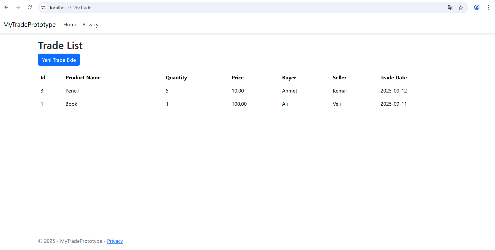
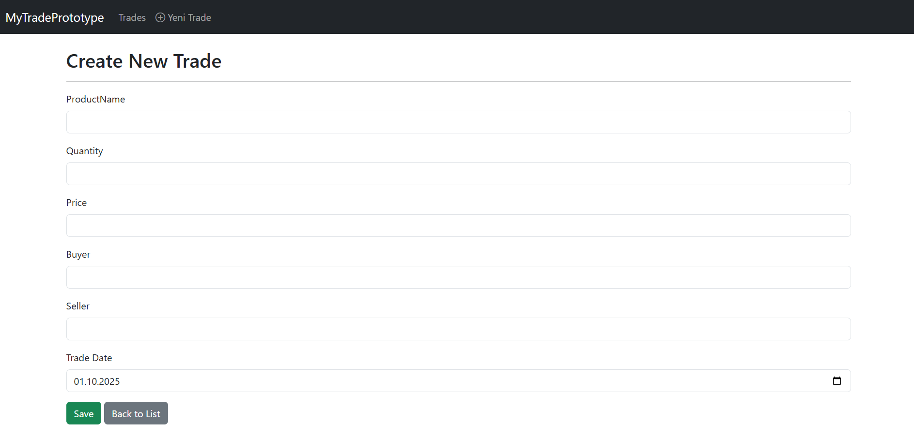
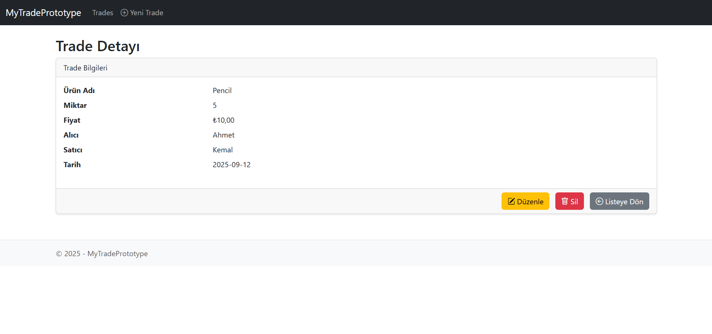

# MyTradePrototype

**Basit Dış Ticaret Yönetim Uygulaması (Prototype)**

Bu proje, ASP.NET Core ve Entity Framework Core kullanılarak geliştirilmiş basit bir dış ticaret veri yönetim sistemi prototipidir. CRUD (Create, Read, Update, Delete) işlemleri ve temel veri görüntüleme özelliklerini içerir.

---

## 🚀 Özellikler

- **Index Sayfası:** Tüm trade kayıtlarını listeler, en yeni işlemler en üstte görünür.
- **Create:** Yeni trade ekleme formu.
- **Details:** Her trade kaydı için detay görüntüleme.
- **Edit & Delete:** Details sayfası üzerinden mevcut trade kaydını düzenleme veya silme.
- **Basit sıralama:** TradeDate alanına göre en yeni işlemler üstte gösterilir.

---

## 🛠 Teknolojiler

- ASP.NET Core MVC
- Entity Framework Core
- SQL Server (LocalDB)
- Bootstrap (Opsiyonel, ileride eklenebilir)

---

## 📂 Proje Yapısı

```text
MyTradePrototype/
├─ Controllers/
│  ├─ TradeController.cs
│  └─ HomeController.cs
│
├─ Data/
│  └─ ApplicationDbContext.cs
│
├─ Models/
│  └─ Trade.cs
│
├─ Views/
│  ├─ Trade/
│  │  ├─ Index.cshtml
│  │  ├─ Create.cshtml
│  │  ├─ Details.cshtml
│  │  ├─ Edit.cshtml
│  │  └─ Delete.cshtml
│  └─ Home/
│     └─ Index.cshtml
│
├─ wwwroot/
│
├─ Screenshots/
│  ├─ Index.png
│  ├─ Create.png
│  └─ Details.png
│
├─ Program.cs
└─ appsettings.json

---

## 📝 Açıklama

- **Trade Modeli:** Id, ProductName, Quantity, Price, Buyer, Seller, TradeDate alanlarını içerir. Prototype aşamasında bu alanlar yeterlidir; ileride Currency, Status, PaymentType gibi alanlar eklenebilir.
- **ApplicationDbContext:** EF Core DbContext sınıfı, Trade tablosunu ve ileride eklenebilecek Customer tablosunu yönetir.
- **Controller:** TradeController; Index, Create, Details, Edit ve Delete işlemlerini yönetir.
- **Index View:** Tüm trade kayıtlarını listeler, en yeni işlemler üstte gösterilir. Details, Edit ve Delete linkleri içerir.
- **Detaylar:** Her trade için ayrı sayfa; düzenleme ve silme işlemleri Details sayfasından yapılabilir.

---

## 📌 Kullanım

Projeyi çalıştırmak için:

1. Visual Studio veya VS Code ile projeyi açın.
2. Gerekli NuGet paketlerini yükleyin (`Microsoft.EntityFrameworkCore`, `Microsoft.EntityFrameworkCore.SqlServer`).
3. `appsettings.json` içindeki `DefaultConnection` ayarını kendi SQL Server ortamınıza göre düzenleyin.
4. EF Core Migration oluşturun ve veritabanını güncelleyin.
5. Uygulamayı çalıştırın ve tarayıcıda `Trade/Index` sayfasını görüntüleyin.

---

## 📸 Ekran Görüntüleri

**Index Sayfası**


**Create Sayfası**


**Details Sayfası**


---

## 📈 Gelecek Geliştirmeler

- Filtreleme ve sayfalama
- Kullanıcı yetkilendirmesi (Authentication & Authorization)
- Gelişmiş arayüz ve Bootstrap entegrasyonu
- Currency, Status ve PaymentType gibi ek trade bilgileri
- API entegrasyonu
